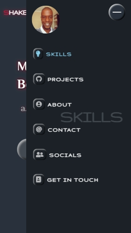
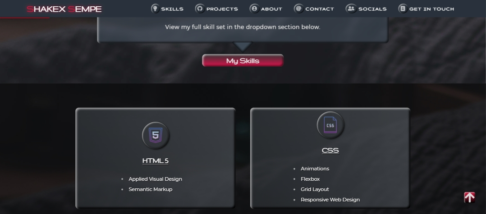
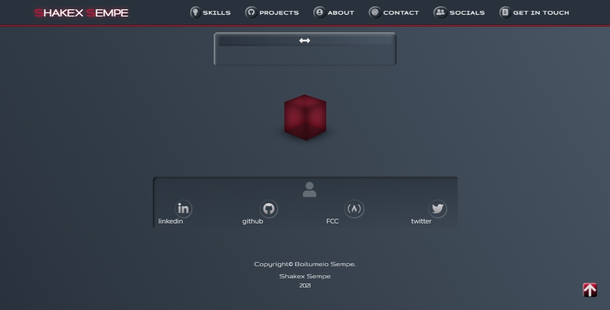

# Portfolio-Webpage

## Welcome Section (Home/Hero)
### Screenshot

-Brand NavBar fixed to the top of the page. Navbar links used to navigate through the page to the corresponding section heading.

-Welcome section covers entire viewport and features animated background and animated text as an introduction.

-Button with animated text and a hover effect, links to the 'About Me' setion of the webpage. 
## sidebar 

#### all section headers have an animated span and a css refection.

## Skills Section
-Features a dropdown menu within which hoverable skills item tiles are placed. 

## Projects Section
- Items added dynamically using javascript template literal syntax to display each indivdual project.
- Project-tile below the image is a link to the project webpage

## Contact Section
- contact details visible on hover

## CV Request Form
- Desktop form 

- mobile form

## Footer

- decorative css3 rotating cube and social media links.

## FreeCodeCamp
### Responsive Web Design Projects #5
This is a Personal Portfolio page which is the last of the freeCodeCamp responsive web design projects.
View the page on the following URL: https://shakexsempe.github.io/Portfolio-Webpage/ 

